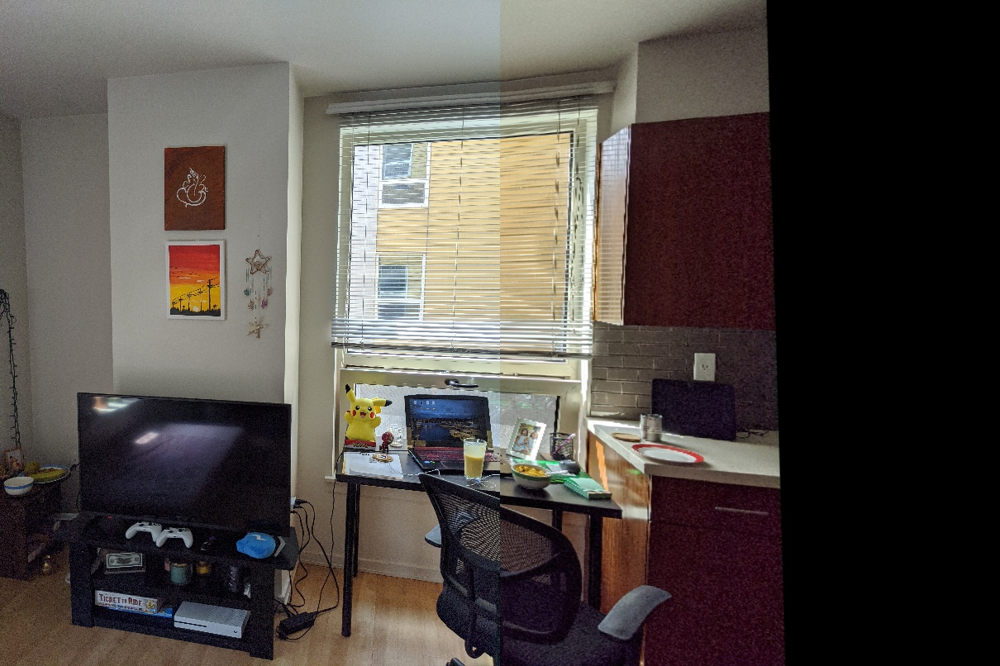
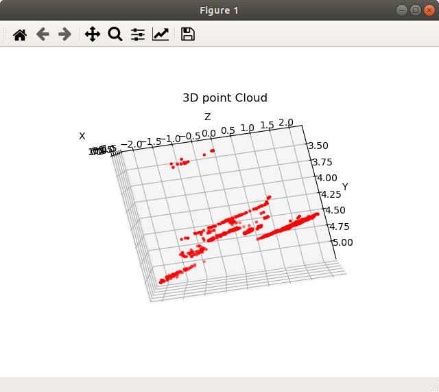

# Computer Vision Projects - Classical and Modern Approaches
Contains Computer Vision projects I implemented out of interest. 

Projects aimed at:
1. Classical Computer Vision Techniques
2. Advanced Computer Vision and Deep Learning
3. Object Tracking and Localization

## Project One: Facial Keypoints Recognition

In this project, I combined my knowledge of computer vision techniques and deep learning architectures to build a facial keypoint detection system that takes in any image with faces, and predicts the location of 68 distinguishing keypoints on each face! Facial keypoints include points around the eyes, nose, and mouth on a face and are used in many applications.

The project is broken down into four main parts:

[Notebook 1](FacialKeypointRecognition/1_LoadAndVisualizeData.ipynb): Loading and Visualizing the Facial Keypoint Data
[Notebook 2](FacialKeypointRecognition/2_Define_TheNetworkArchitecture.ipynb): Defining and Training a Convolutional Neural Network (CNN) to predict Facial Keypoints
[Notebook 3](FacialKeypointRecognition/3_FacialKeypointDetectionCompletePipeline.ipynb): Facial Keypoint Detection Using Haar Cascades and our trained CNN.
[Notebook 4](FacialKeypointRecognition/4_ApplicationsKeypoints.ipynb): Applications using Facial Keypoints

## Project Two: Virtual Pen and Eraser

I recently came across posts on linkedin, where people were drawing virtually on the screen, originally posted by Mr. Taha Anwar. So, I thought why not try it on my own! Though the original version works on color thresholding to extract the pen from the scene, I had a hard time(& changing light intensities in my background) finding a right range. Hence, I added an aruco marker(tag id: 0) to act as a pen. Feel free to use this version and build your version upon it. A couple of other id markers can work for various colors and even eraser.

## Project Three: Panaroma Creator

In this mini-mini-project, I have build a custom panaroma script using Feature Matching through ORB algorithm. This is followed by Image Alignment after finding the Homogenous Transformation between the two images and applying perspective transformation to one of the image.

## Project Four: Structure from Motion

In this project, I performed structure from motion(a.k.a structure and motion) on an image dataset. The project was extensive and it required a good hand in geometrical transformation techniques. Overall, I am happy(somewhat) to finish it but there are a great amount of modifications I see possible to make it better. I update this project and make it better soon. Here is my course of action:

- [x] Camera Calibration for custom dataset.  
- [x] Feature Tracking using Optic Flow.  
- [x] Image Rectification.  
- [x] Triangulation.  
- [x] 3D Point Cloud Generation.  
- [ ] Bundle Adjustment.  
- [ ] Visualization through Mayavi/Open3D.  
- [ ] Iterative pipeline for real-time video.

## Project Five: Augmented Reality

In this project, I am placing a 3d object() on a flat surface in this project.

# . . .

